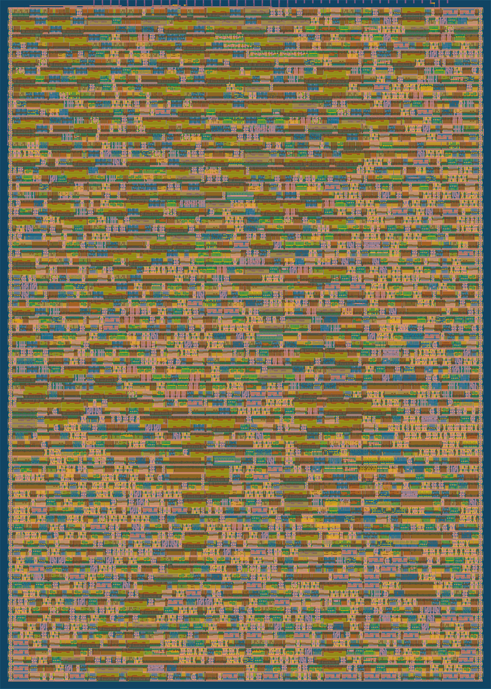

<!---

This file is used to generate your project datasheet. Please fill in the information below and delete any unused
sections.

You can also include images in this folder and reference them in the markdown. Each image must be less than
512 kb in size, and the combined size of all images must be less than 1 MB.
-->

# Warp

> Please make sure to watch the demo for a few minutes as various effects play
> out before it loops. At start it waits for a few seconds to ensure VGA sync is
> achieved.

Keep in mind this is hardware in ~3000 gates. There's no cpu/gpu/ram, and it fits on 161x225 μm (130nm transistors).

## How it works

> *But does it work in ASIC?*

**[Update, January 2026]** Yes it does!!!!

### Preface

This demo is written in [Silice](https://github.com/sylefeb/Silice/), my HDL.
Here is the [actual source](../src/silice/vga_demo.si). Silice now fully supports TinyTapeout as a build target.

Check out the [3D view of the chip](https://legacy-gltf.gds-viewer.tinytapeout.com/?model=https://sylefeb.github.io/tt08-compo-entry/tinytapeout.gds.gltf).

### Why a tunnel effect?

The core effect is a classical [tunnel effect](https://lodev.org/cgtutor/tunnel.html) ; however this is normally done with a "huge" pre-computed table having
one entry per-pixel, and there is no way such a per-pixel table would fit in the design. So I thought it'd be challenging and fun to do it while
racing the beam! Plus, I really [like this effect](https://htmlpreview.github.io/?https://github.com/sylefeb/gfxcat/blob/main/runtime/gfxcat_tunnel.html).

As a rule of thumb, a 640x480 -- the resolution this is running at -- would require at least 256KB (262144 bytes) of pre-computed data. We have roughly ~4000 logic cells, so ... well yes, it's not gonna fit :-)

### Graphics

#### The tunnel

There are several tricks at play: a shallow
[CORDIC](https://en.wikipedia.org/wiki/CORDIC) pipeline to compute an *atan* and *length*, and a few precomputed *1/x* distances to interpolate between -- these form keypoint rings along the tunnel. All the effects are then obtained by combining multiple layers in various ways (like a *tunnel effect processor* which registers can be configured for various effects).

Ok let's decompose this paragraph! Below you see the *atan* and *length* computed by the demo, followed by the *1/x* interpolation rings and the *1/length* image (internally available at a higher bit-depth, remapped for visualization).

    
    
    
    

Normally computing all of these quantities would take ~20 iterations per pixel. So of course that's not possible, because we are targeting a 25 MHz clock matching the video signal generator and one pixel has to go out *every cycle*. We could maybe run the clock 2x or 4x, but certainly not 20x (0.5GHz). So what can we do? First, a precomputed division, and second -- most importantly -- a pipeline.

First, let's get rid of the division. The top right image shows distance to the center -- *length* -- and the bottom right shows *1/length* which we want for the perspective effect. Now, instead of computing an actual general division we can use an old trick: we know the range of value if we ignore a small ring inside the center, where distance goes to zero. That's fine, we'll just mask that out in 'the darkness of space'. Knowing a few $1/x$ values we can setup interpolation interpolation rings, as shown bottom left. There's a tradeoff: fewer rings use less space but reveal distortion, many rings are accurate but use a ton of space. Guess what, I spent a lot of time playing with the number of rings :) (fortunately Silice pre-processor makes this kind of parameter exploration easy).

Second, the most important part, the pipeline! Even without division we are left with (at least) 5 iterations of CORDIC for a good effect. The idea is that at every clock, we compute all required 5 steps, but in parallel for different pixels. At a cycle $i$ pixel $x$ enters the pipeline and we compute iteration $0$ on it. But at the same time we have $x-1$ at iteration $1$, $x-2$ at iteration $2$, $x-3$ at iteration $3$, and so on. At full peak, the pipeline outputs one pixel every iteration, while applying all five iterations to *different* pixels at once. In ASIC we don't have to do super-deep pipelines because the signal propagate very fast (compared to e.g. an FPGA) so the actual pipeline of Warp is 'only' two stages for CORDIC and five stages in total, because of course a lot happens after CORDIC to make all the tunnel variants!

### Register combiners

Controlling the various effects -- there are many tunnel variants -- is done through a set of registers. Changing there values produce variants of the tunnel. To me this is reminiscent of the good-old-days of [GPU register combiners](https://registry.khronos.org/OpenGL/extensions/NV/NV_register_combiners.txt)!

The code for that is shown below:

    

At the top you can see a commented switch-case. That's how it started, and then it ended up squashed into an unreadable optimized logic below :) This sets up all the key registers that control the tunnel effect (`ma1`,`ma2`,`ma3`,`rseg1`,`rseg2`,`rseg3`,`cmode`,`mmode`). These are used in the logic afterwards. They control the texture, the viewpoint, the color shifts, etc. The master is `effect` and it is updated with the number of passing frames.

    

### Additional effects

The demo uses a lot of dithering (ordered Bayer dithering) given the output is RGB 2-2-2. All computations are grayscale and the RGB lense effect is obtained by delaying the grayscale values using the tunnel distance in R and B.

The tunnel viewpoint change is obtained simply by shifting the tunnel center. I was surprised that a simple translation gives such a convincing effect (almost as if the viewpoint was rotating).

The 'blue-orange' tunnel effect is obtained through temporal dithering, one frame being the standard tunnel, the other the rotated tunnel. This gets combined with the RGB lense distortion, achieving the final look.

#### The logo

Since the start I knew the demo would be called 'Warp', I got this clear idea
of an uncontrolled space warp unfolding after a computer crashed.

> The demo has a back-story, check out the [code source header](https://github.com/sylefeb/tt08-compo-entry/blob/170801e86eb10668c15830027dbd7b193c6d5677/src/silice/vga_demo.si#L10). Hey, it's no
> Hugo-prize winner but we've seen many games with less storytelling ;)

    

So of course I wanted a cool logo to go with it. I initially went for a pixelated
look but it felt crude, so I started to ponder about a cleaner outline. The
key idea was to do it from tiles: a square and triangles in various symmetries.
From their, a comparator and a bit of logic is used to do all four possible triangles.

Btw, I still have the drawing on my board two years later!! (it did suffer a bit).

    

Look carefully at the code above (lines 82-85) and the W on the board. Can you see it?

### Audio

I am no musician, so making a soundtrack was a challenge for me, but that's something I've always wanted to try. In the end it was a very enjoyable part of the design, and I was surprised
at how compact this can be made, the soundtrack using perhaps around 10% of the entire design.

I tried to make a track that matches the spirit and rhythm of the graphics. It is what is is, but I'm happy that there's sound at all!

The audio unit [is here](https://github.com/sylefeb/tt08-compo-entry/blob/1a64b6fefaaef9963322092fc917bb73be507f7d/src/silice/vga_demo.si#L370).

In Silice code, this is what the music track looks like:

    

The arrays here are the entire track, and the code that follow implements bass, drums and keys.

## How to test

Plug the VGA+audio PMODs to the board and run. Maybe it works? **[Update, January 2026]** Yes it does!!!!

Simulation of both audio and video can run on an ECPIX5, with the Diligent VGA
PMOD on ports 0,1 and an I2S audio PMOD on port 2 (upper row).
The audio also runs on an ULX3S using its DAC (but no video in this case).

## ASIC

The design reached a very high density, **95.62%** utilization. This may be due to the pipelined nature of its core computations? In any case it's pretty cool as it means it uses almost every bit of available space!

The chip is shown below but also check out the [3D view](https://legacy-gltf.gds-viewer.tinytapeout.com/?model=https://sylefeb.github.io/tt08-compo-entry/tinytapeout.gds.gltf).

    

## External hardware

- [VGA PMOD](https://github.com/mole99/tiny-vga)
- [Audio PMOD](https://github.com/MichaelBell/tt-audio-pmod)

See https://tinytapeout.com/competitions/demoscene/
